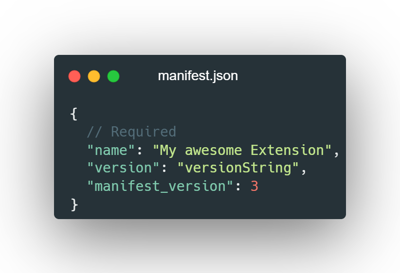
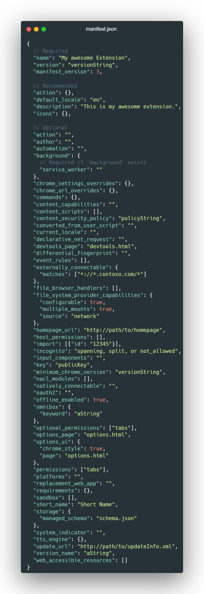
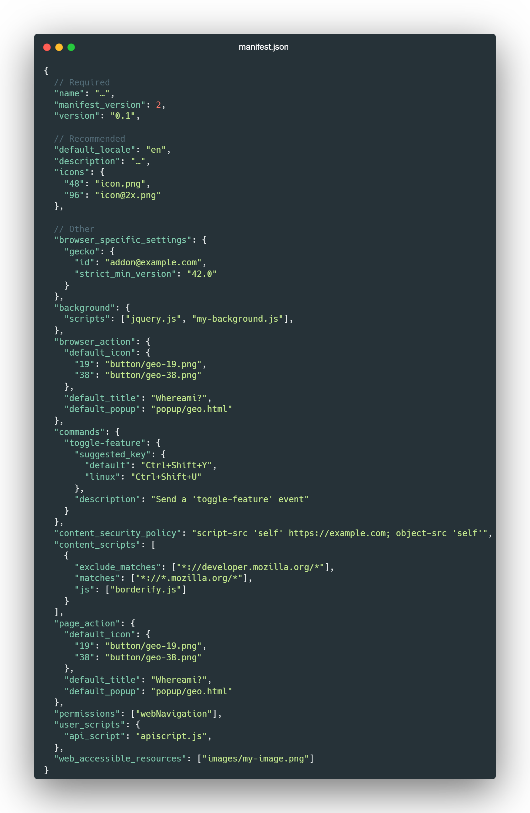

# Le squelette
Afin de pouvoir créer une extension, nous avons seulement besoin d'un seul élément : le fichier *Manifest*.

Or, les extensions contiennent bien souvent a minima : un fichier HTML et des fichiers *CSS* si l'extension est amené à avoir une interface utilisateur et forcément un ou des fichiers *JavaScript*.

Il est vivement recommandé d'avoir des fichiers *CSS* et *JavaScript* séparés.

Toute extension, quelle que soit la plateforme où elle sera publiée, est doté d'un fichier JSON que l'on nomme `manifest.json`.

En effet, à l'instar d'un `composer.json` ou d'un `package.json`, il va contenir des informations essentielles de l'extension et de sa plateforme de distribution comme :
- son numéro de version
- son nom
- une de ses particularités, les permissions requises pour l'exécuter
- et ainsi de suite...

Les fichiers Manifest diffèrent d'une plateforme à une autre, mais vous verrez qu'ils ont tous les mêmes propriétés basiques.

## Le fichier Manifest : Chromium
> Voir Différences entre navigateurs

Les bénéfices avec Chromium sont multiples, notamment avoir un seul paquetage (bundle) pour l'ensemble des navigateurs Chromium (Chrome, Opera, Brave, Vivaldi, Edge, etc.)

Attention, il existe deux versions du fichier *Manifest*.

Le *Manifest V3* est la dernière version qui, par rapport à la V2, améliore la confidentialité, la sécurité et la performance.

Tout comme les PWA, les extensions V3 vont utiliser des promesses et des services workers pour exécuter du code en arrière-plan et hors-ligne.

En Octobre 2020, Microsoft a annoncé la decision d’adopter *Manifest V3* pour aider à réduire la fragmentation du Web pour tous les développeurs (en d'autres termes, uniformiser les pratiques).

Il est surtout recommandé de migrer vers la V3 car le support de la V2 sera abandonné juin 2023 pour tous les navigateurs basés sur Chromium et qu'il est impossible de publier ou mettre à jour une extension V2 sur le Microsoft Store à l'heure actuelle.

L'exemple suivant correspond au minimum nécessaire du `manifest.json` pour le fonctionnement d'une extension Web :
<!--  -->
```json
{
    "name": "My Awesome Extension",
    "version": "0.0.0.1",
    "manifest_version": 3
}
```

Voici un exemple de *Manifest V3* complet :
<!--  -->
```json
{
  // Required
  "name": "My awesome Extension",
  "version": "versionString",
  "manifest_version": 3,

  // Recommended
  "action": {},
  "default_locale": "en",
  "description": "This is my awesome extension.",
  "icons": {},

  // Optional
  "action": "",
  "author": "",
  "automation": "",
  "background": {
    // Required if `background` exists
    "service_worker": ""
  },
  "chrome_settings_overrides": {},
  "chrome_url_overrides": {},
  "commands": {},
  "content_capabilities": "",
  "content_scripts": [],
  "content_security_policy": "policyString",
  "converted_from_user_script": "",
  "current_locale": "",
  "declarative_net_request": "",
  "devtools_page": "devtools.html",
  "differential_fingerprint": "",
  "event_rules": [],
  "externally_connectable": {
    "matches": ["*://*.contoso.com/*"]
  },
  "file_browser_handlers": [],
  "file_system_provider_capabilities": {
    "configurable": true,
    "multiple_mounts": true,
    "source": "network"
  },
  "homepage_url": "http://path/to/homepage",
  "host_permissions": [],
  "import": [{"id": "12345"}],
  "incognito": "spanning, split, or not_allowed",
  "input_components": "",
  "key": "publicKey",
  "minimum_chrome_version": "versionString",
  "nacl_modules": [],
  "natively_connectable": "",
  "oauth2": "",
  "offline_enabled": true,
  "omnibox": {
    "keyword": "aString"
  },
  "optional_permissions": ["tabs"],
  "options_page": "options.html",
  "options_ui": {
    "chrome_style": true,
    "page": "options.html"
  },
  "permissions": ["tabs"],
  "platforms": "",
  "replacement_web_app": "",
  "requirements": {},
  "sandbox": [],
  "short_name": "Short Name",
  "storage": {
    "managed_schema": "schema.json"
  },
  "system_indicator": "",
  "tts_engine": {},
  "update_url": "http://path/to/updateInfo.xml",
  "version_name": "aString",
  "web_accessible_resources": []
}
```

## Firefox : Le fichier Manifest
Avec Firefox, nous parlons plutôt de WebExtensions.

> Voir Différences entre navigateurs

L'avantage de Firefox est qu'il s'agit du navigateur qui supporte le plus de fonctionnalités et APIs, le rendant le plus polyvalent (voir [le tableau des compatibilités](https://developer.mozilla.org/en-US/docs/Mozilla/Add-ons/WebExtensions/manifest.json#browser_compatibility)).

Il a aussi une communauté plus ouverte, collaborative et active que Chromium. Les développeurs peuvent publier leurs extensions sur le [Marketplace](https://addons.mozilla.org/fr/firefox/).

Voici un exemple de *Manifest* pour Firefox :
<!--  -->
```json
{
  // Required
  "name": "…",
  "manifest_version": 2,
  "version": "0.1",
  
  // Recommended
  "default_locale": "en",
  "description": "…",
  "icons": {
    "48": "icon.png",
    "96": "icon@2x.png"
  },

  // Other
  "browser_specific_settings": {
    "gecko": {
      "id": "addon@example.com",
      "strict_min_version": "42.0"
    }
  },
  "background": {
    "scripts": ["jquery.js", "my-background.js"],
  },
  "browser_action": {
    "default_icon": {
      "19": "button/geo-19.png",
      "38": "button/geo-38.png"
    },
    "default_title": "Whereami?",
    "default_popup": "popup/geo.html"
  },
  "commands": {
    "toggle-feature": {
      "suggested_key": {
        "default": "Ctrl+Shift+Y",
        "linux": "Ctrl+Shift+U"
      },
      "description": "Send a 'toggle-feature' event"
    }
  },
  "content_security_policy": "script-src 'self' https://example.com; object-src 'self'",
  "content_scripts": [
    {
      "exclude_matches": ["*://developer.mozilla.org/*"],
      "matches": ["*://*.mozilla.org/*"],
      "js": ["borderify.js"]
    }
  ],
  "page_action": {
    "default_icon": {
      "19": "button/geo-19.png",
      "38": "button/geo-38.png"
    },
    "default_title": "Whereami?",
    "default_popup": "popup/geo.html"
  },
  "permissions": ["webNavigation"],
  "user_scripts": {
    "api_script": "apiscript.js",
  },

  "web_accessible_resources": ["images/my-image.png"]
}
```

## Firefox : Scripts and UI
Sachant que la disposition des éléments dans Firefox est très personnalisable, les composants sont répertoriés dans plusieurs catégories comme le schéma suivant montre :
- Scripts d'arrière-plan : conservent des états et données qui persistent jusqu'à ce que l'extension soit désinstallée ou désactivée.
```json
"background": {
  "scripts": ["background-script.js"]
//   "page": "background-page.html" # qui contient le script de type module
}
```
- Composants d'interface utilisateur
    - Barres latérales : volets s'affichant dans la partie gauche de la fenêtre du navigateur.
    - Boîtes de dialogues : modaux s'affichant après interactions avec la barre d'adresse ou des boutons de la barre d'outil.
    - Pages d'options : pages de préférences accessibles par l'utilisateur via (clic droit) le gestionnaire d'addons.
    - Scripts de contenu : scripts s'exécutant (ou feuilles de styles s'injectant) dans le contexte d'une page Web (ex: pour une manipulation du DOM ou un thème sombre) communiquant avec les scripts d'arrière-plan via `window.postMessage()`.
    - Pages d'extension : des pages créées généralement de manière procédurale via `windows.create()` ou `tabs.create()` qui sont non catégorisées et donc non spécifiées dans le Manifest mais sans différences pour les accès aux APIs.
    - Ressources Web : fichiers multi médias, scripts, feuilles de styles...

## TP 1